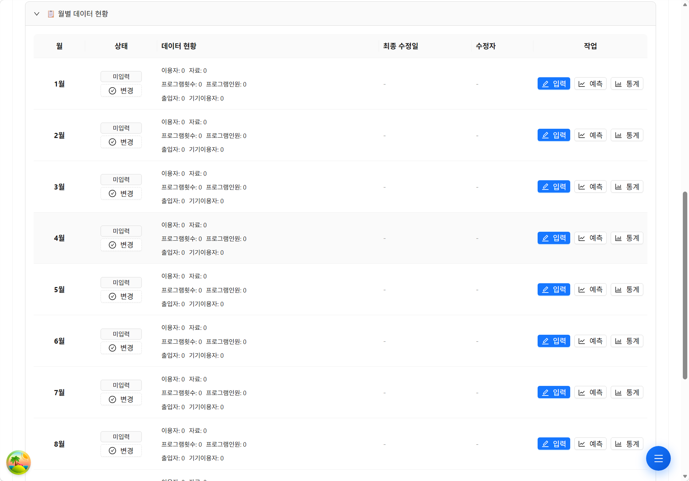
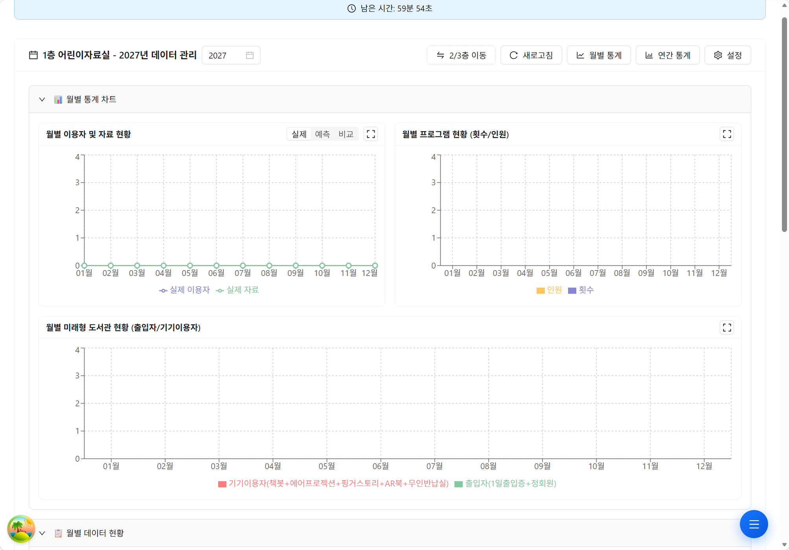
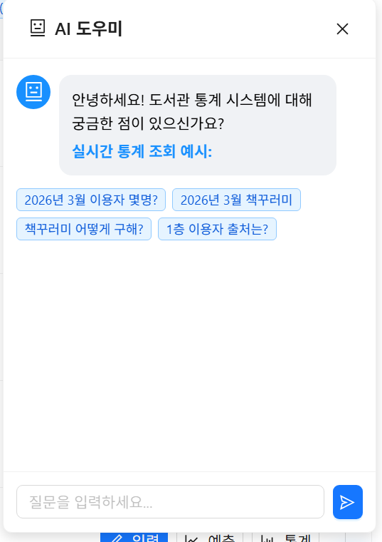
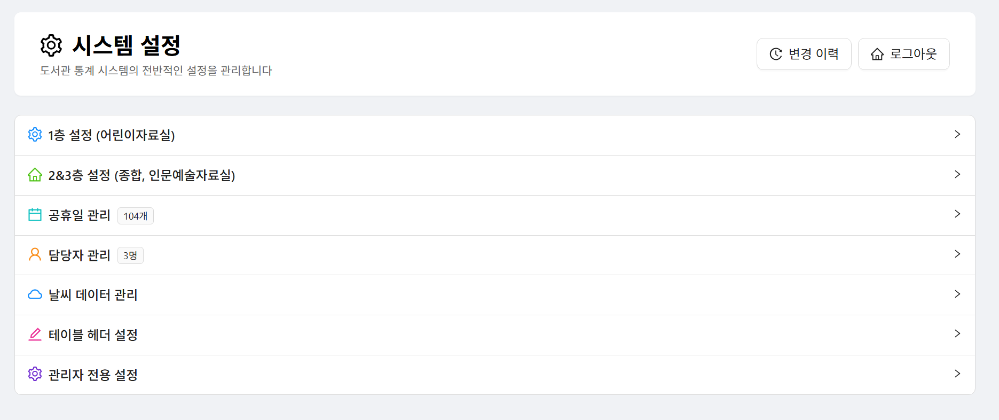

# Library Statistics Template

A template-driven library statistics management system. Upload any library's Excel template, enter monthly data through a web-based spreadsheet editor, and export completed reports — no code changes needed per library.

**Live Demo:** https://yougjun.github.io/library-stats-template/

> Built with Claude Code + GPT. AI handled CRUD scaffolding, React components, and TypeScript types.
> Data modeling, PostgreSQL query tuning, concurrency handling, and ML pipeline design were done manually.
> In production at a public library for 6+ months — reduced monthly statistics work from 3–4 days to under 1 hour.

## Screenshots

| Dashboard | Charts |
|:-:|:-:|
|  |  |

| AI Chatbot | Settings |
|:-:|:-:|
|  |  |

## Stack

| Layer | Tech |
|-------|------|
| Frontend | React 18, Vite, Ant Design, Univer (spreadsheet editor) |
| Backend | FastAPI, SQLAlchemy, PostgreSQL |
| Real-time | Socket.IO |
| AI | Multi-LLM (Gemini/GPT/Anthropic), ChromaDB RAG |
| Deploy | GitHub Pages (frontend), GitHub Actions CI/CD |

## Project Structure

```
library-stats-template/
├── backend/
│   └── app/
│       ├── main.py              # FastAPI + Socket.IO entry
│       ├── config.py            # Environment config
│       ├── routes/              # API endpoints
│       ├── models/              # SQLAlchemy models
│       ├── services/            # Business logic
│       ├── middleware/           # Logging, bandwidth, cache, security
│       └── mappings/            # Dynamic cell mapping resolver
├── frontend/
│   └── src/
│       ├── App.tsx              # Router
│       ├── pages/               # Page components
│       ├── components/          # UI components + Univer editor
│       ├── hooks/               # React Query hooks
│       ├── store/               # Zustand state (auth, editor)
│       └── services/api.ts      # Axios API client
└── .github/workflows/ci.yml    # CI/CD pipeline
```

## Quick Start

### Prerequisites

- Node.js 20+
- Python 3.10+
- PostgreSQL

### Backend

```bash
cd backend
python -m venv venv && source venv/bin/activate
pip install -r requirements.txt

cp .env.example .env   # edit with your DB credentials and API keys

uvicorn app.main:socket_app --host 0.0.0.0 --port 3112
```

### Frontend

```bash
cd frontend
npm ci

cp .env.example .env   # edit VITE_API_URL if needed

npm run dev            # dev server on http://localhost:3111
```

The dev server proxies `/api` and `/socket.io` requests to `localhost:3112`.

## Application Flow

```
Login (site password or access code)
  │
  ├── Template-Driven Input
  │     1. Upload Excel template (.xlsx)
  │     2. System analyzes structure (headers, formulas, merged cells)
  │     3. Admin marks input vs computed cells
  │     4. Users enter monthly data in Univer spreadsheet editor
  │     5. Export filled Excel with formulas intact
  │
  ├── Template Editor ── Edit/preview Excel templates in-browser (Univer)
  │
  ├── Settings ── Library config, holidays, automation, admin users
  │
  └── AI Chat ── RAG-powered assistant for data queries
```

## Key Features

**Template-Driven Data Entry** — Upload any library's Excel template and the system auto-detects structure. No hardcoded models needed per library.

**Univer Spreadsheet Editor** — Full in-browser spreadsheet with formula engine (runs formulas client-side via web worker).

**Dynamic Cell Mapping** — Map template cells to data fields via a field catalog. The system resolves mappings at export time.

**AI Chat** — RAG-powered assistant with multi-LLM support (Gemini/GPT/Anthropic), ChromaDB vectors, and NLU for natural language queries.

**Excel Export** — Generate completed `.xlsx` files with original formulas preserved.

**PWA** — Installable as a mobile/desktop app with offline caching.

## API Overview

| Prefix | Purpose |
|--------|---------|
| `/api/auth` | Login, token refresh, access codes |
| `/api/admin` | Admin user management |
| `/api/template-driven` | Template upload, cell roles, data entry, export |
| `/api/excel` | Excel template editor & generation |
| `/api/chat` | AI chat & knowledge base |
| `/api/settings` | App configuration |
| `/api/weather` | Weather data |
| `/api/automation` | Scheduled tasks |

## Environment Variables

### Backend (`backend/.env`)

| Variable | Description |
|----------|-------------|
| `DATABASE_URL` | PostgreSQL connection string |
| `SECRET_KEY` | JWT signing key |
| `LIBRARY_NAME` | Display name for this library instance |
| `TEMPLATE_FILENAME` | Default Excel export filename |
| `WEATHER_API_KEY` | Weather API key (optional) |
| `GOOGLE_AI_API_KEY` | Gemini API for chat features |
| `LLM_PROVIDER` | LLM backend: `gemini`, `openai`, or `anthropic` |
| `OPENAI_API_KEY` | OpenAI API key (if using GPT) |
| `ANTHROPIC_API_KEY` | Anthropic API key (if using Claude) |
| `CHROMADB_PATH` | ChromaDB vector store path (default: `data/chromadb`) |

### Frontend (`frontend/.env`)

| Variable | Description |
|----------|-------------|
| `VITE_API_URL` | Backend API URL (default: `http://localhost:3112`) |
| `VITE_LIBRARY_NAME` | Library name shown in UI |
| `VITE_DOWNLOAD_FILENAME` | Default download filename |

## CI/CD

Push to `main` triggers GitHub Actions:

1. **Python Syntax Check** — validates all `.py` files
2. **Lint & Auto-fix** — ESLint with auto-commit
3. **Build & Deploy** — `tsc` + `vite build` → GitHub Pages

The frontend is a static SPA deployed to GitHub Pages. The backend requires a separate server with PostgreSQL.

## Adapting for Your Library

1. Fork this repository
2. Set backend environment variables (DB, library name, API keys)
3. Upload your library's Excel statistics template via the Template-Driven page
4. Mark which cells are user-input vs formula-computed
5. Users can now enter monthly data and export filled reports
